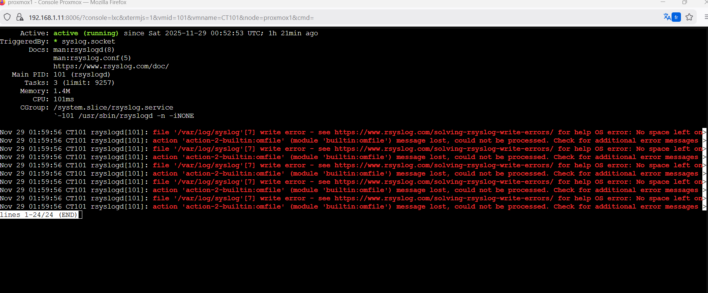

# 🚀 Mon HomeLab - Journal d'Apprentissage Linux

Salut ! Je suis Jaouad, passionné par l'informatique et actuellement en formation sur Linux. 

Ce repository est mon journal de bord : chaque jour je documente les problèmes que je rencontre, comment je les résous, et ce que j'apprends. C'est mon terrain de jeu pour progresser en administration système !

## 🎯 Pourquoi ce projet ?

J'ai monté ce HomeLab pour :
- Apprendre en pratiquant (la meilleure façon d'apprendre !)
- Documenter mes galères et mes victoires jour après jour
- Créer une base de connaissances pour mes futurs projets
- Montrer ma progression et ma motivation à apprendre

## 💻 Mon Environnement

J'ai monté un vrai HomeLab avec :
- **Serveur physique** : Proxmox VE
- **Conteneur LXC** : Ubuntu Server 22.04 LTS
- **Réseau** : Configuration Netplan

---

## 📸 Galerie Rapide - Toutes les Interventions

<table>
  <tr>
    <td align="center" width="33%">
      <a href="#jour-1">
        <br/>
        <b>Jour 1 - PATH Corrompu</b><br/>
        Variable système vide
      </a>
    </td>
    <td align="center" width="33%">
      <a href="#jour-2">
        <br/>
        <b>Jour 2 - Panne Réseau</b><br/>
        Interface DOWN
      </a>
    </td>
    <td align="center" width="33%">
      <a href="#jour-3">
        <br/>
        <b>Jour 3 - Panne DNS</b><br/>
        Service inactif
      </a>
    </td>
  </tr>
  <tr>
    <td align="center" width="33%">
      <a href="#jour-4">
        <br/>
        <b>Jour 4 - Problème Disque</b><br/>
        Fichier suspect détecté
      </a>
    </td>
    <td align="center" width="33%">
      <a href="#jour-5">
        <br/>
        <b>Jour 5 - Logs Système</b><br/>
        Historique des pannes
      </a>
    </td>
    <td align="center" width="33%">
      <a href="#jour-5">
        <br/>
        <b>État Final</b><br/>
        ✅ 100% Opérationnel
      </a>
    </td>
  </tr>
</table>

---

## 📅 Journal des Interventions

### <a id="jour-1"></a>🗓️ Jour 1 - 25/11/2025 : Corruption PATH - Variable système vide

**🎯 Mission du jour** : Réparer un système où plus aucune commande ne fonctionne

#### 📋 Situation
Toutes mes commandes retournent "command not found". Même `ls` ! 😱
Ma réaction : "Euh... j'ai complètement cassé le conteneur ?!"

#### 🔍 Diagnostic

<details>
<summary>📸 Cliquez pour voir la capture du problème</summary>


*Variable PATH vide - Aucune commande accessible*

</details>

**Commandes de diagnostic** :
```bash
echo $PATH                       # Résultat : vide !
cat /etc/environment            # Fichier corrompu
```

**Constat** : Le PATH définit où le système cherche les commandes. Sans PATH = système inutilisable.

#### ✅ Solution appliquée

**Étape 1 - Fix temporaire** :
```bash
export PATH=/usr/local/sbin:/usr/local/bin:/usr/sbin:/usr/bin:/sbin:/bin
```

**Étape 2 - Fix permanent** :
Correction dans `/etc/environment`

**Étape 3 - Vérification** :
```bash
reboot
echo $PATH
ls -la  # Test commande
```

<details>
<summary>📸 Cliquez pour voir la résolution</summary>


*PATH restauré - Toutes les commandes fonctionnelles ✅*

</details>

#### 📚 Ce que j'ai appris
- ✅ Le PATH est CRITIQUE pour le système
- ✅ **Toujours** faire un snapshot avant de modifier `/etc/environment`
- ✅ Différence entre `export` (temporaire) et fichier (permanent)
- ✅ Les snapshots Proxmox sauvent la vie !

**Temps de résolution** : 1h (avec snapshot de secours)

---

### <a id="jour-2"></a>🗓️ Jour 2 - 26/11/2025 : Panne réseau - Interface désactivée

**🎯 Mission du jour** : Résoudre un problème de connectivité réseau

#### 📋 Situation
Impossible de pinger Google depuis mon conteneur. Panique totale !

#### 🔍 Diagnostic

<details>
<summary>📸 Cliquez pour voir la capture du problème</summary>


*Interface eth0 en état DOWN - Aucune connectivité réseau*

</details>

**Commandes utilisées** :
```bash
ip a                              # Vérification état interfaces
ip link show                      # Statut des liens réseau
cat /etc/netplan/*.yaml          # Lecture config réseau
```

**Constat** :
- Interface eth0 est DOWN
- Le réseau est physiquement OK côté Proxmox
- Le problème est dans la configuration du conteneur

#### ✅ Solution appliquée

1. Vérification de la config Netplan
2. Correction de la configuration réseau
3. Application : `sudo netplan apply`

<details>
<summary>📸 Cliquez pour voir l'application de Netplan</summary>


*Application réussie de la configuration Netplan*

</details>

4. Test : `ping -c 4 8.8.8.8`

<details>
<summary>📸 Cliquez pour voir le diagnostic interface</summary>


*Vérification complète de l'interface réseau*

</details>

#### 📚 Ce que j'ai appris
- ✅ Toujours vérifier l'état des interfaces en premier avec `ip a`
- ✅ Netplan est le gestionnaire réseau moderne sur Ubuntu
- ✅ La syntaxe YAML est stricte (attention aux espaces !)
- ✅ Vérifier aussi la config réseau du conteneur dans Proxmox

**Temps de résolution** : 45 minutes

---

### <a id="jour-3"></a>🗓️ Jour 3 - 27/11/2025 : Panne DNS - Service systemd-resolved inactif

**🎯 Mission du jour** : Réparer la résolution de noms de domaine

#### 📋 Situation
Le ping sur 8.8.8.8 fonctionne mais pas sur google.com. Étrange...

#### 🔍 Diagnostic

<details>
<summary>📸 Cliquez pour voir la capture du problème</summary>


*Service systemd-resolved inactif - Pas de résolution DNS*

</details>

**Analyse** :
- ✅ Connectivité réseau OK (ping IP fonctionne)
- ❌ Résolution DNS KO (ping domaine échoue)
- Service systemd-resolved inactif

**Commandes de diagnostic** :
```bash
ping -c 4 8.8.8.8               # Test IP
ping -c 4 google.com            # Test DNS
systemctl status systemd-resolved
```

#### ✅ Solution appliquée
```bash
sudo systemctl start systemd-resolved
sudo systemctl enable systemd-resolved
systemctl status systemd-resolved
ping -c 4 google.com
```

#### 📚 Ce que j'ai appris
- ✅ Différence entre connectivité (couche 3) et DNS (couche application)
- ✅ `systemd-resolved` gère le DNS sur Ubuntu moderne
- ✅ Importance de `enable` pour démarrage automatique
- ✅ Dans LXC, le DNS peut hériter de Proxmox

**Temps de résolution** : 30 minutes

---

### <a id="jour-4"></a>🗓️ Jour 4 - 28/11/2025 : Problème Disque - Fichier suspect détecté

**🎯 Mission du jour** : Analyser et nettoyer un fichier suspect sur le disque

#### 📋 Situation
Lors d'un contrôle de routine, j'ai détecté un fichier nommé "fakefile" qui ne devrait pas être là.

#### 🔍 Diagnostic

<details>
<summary>📸 Cliquez pour voir la capture du problème</summary>


*Fichier "fakefile" détecté lors du diagnostic disque*

</details>

**Commandes utilisées** :
```bash
ls -lah                         # Liste détaillée des fichiers
file fakefile                   # Type du fichier
cat fakefile                    # Contenu du fichier
df -h                          # Espace disque
```

#### ✅ Solution appliquée

1. Analyse du fichier avec `file` et `cat`
2. Vérification qu'il n'est pas critique
3. Suppression sécurisée : `rm fakefile`
4. Vérification de l'espace disque libéré

#### 📚 Ce que j'ai appris
- ✅ Toujours analyser avant de supprimer
- ✅ Utiliser `file` pour identifier le type
- ✅ Vérifier l'espace disque régulièrement avec `df -h`
- ✅ Ne jamais supprimer sans comprendre

**Temps de résolution** : 15 minutes

---

### <a id="jour-5"></a>🗓️ Jour 5 - 29/11/2025 : Logs système - Activation et historique

**🎯 Mission du jour** : Réactiver la journalisation et analyser l'historique des pannes

#### 📋 Situation
Je veux consulter l'historique des pannes mais les logs ne sont pas actifs.

#### 🔍 Diagnostic

<details>
<summary>📸 Cliquez pour voir l'historique des pannes</summary>


*Historique des pannes système dans syslog*

</details>

**Analyse** :
```bash
ls -lh /var/log/syslog          # Fichier vide ou ancien
systemctl status rsyslog         # Service inactif
journalctl -xe                   # Logs temporaires seulement
```

#### ✅ Solution appliquée
```bash
sudo systemctl start rsyslog
sudo systemctl enable rsyslog
systemctl status rsyslog
tail -f /var/log/syslog
```

<details>
<summary>📸 Cliquez pour voir la résolution</summary>


*Service rsyslog actif - Journalisation opérationnelle ✅*

</details>

#### 📚 Ce que j'ai appris
- ✅ Les logs sont ESSENTIELS pour le diagnostic
- ✅ `rsyslog` = journalisation persistante sur Ubuntu
- ✅ Sans logs = impossible de débugger efficacement
- ✅ Toujours vérifier rsyslog dans un nouveau conteneur
- ✅ Analyser l'historique pour comprendre les patterns de pannes

**Temps de résolution** : 20 minutes

---

## 🛠️ Boîte à Outils - Commandes Essentielles

### Diagnostic Réseau
```bash
ip a                              # État des interfaces
ip link show                      # Statut des liens
ping -c 4 8.8.8.8                # Test connectivité IP
ping -c 4 google.com             # Test DNS
cat /etc/netplan/*.yaml          # Config réseau
sudo netplan apply               # Appliquer config
```

### Gestion des Services
```bash
systemctl status service          # État d'un service
systemctl start service           # Démarrer
systemctl stop service            # Arrêter
systemctl restart service         # Redémarrer
systemctl enable service          # Activer au boot
journalctl -xe                    # Logs détaillés
journalctl -u service             # Logs d'un service
```

### Système et Disque
```bash
df -h                            # Espace disque
ls -lah                          # Liste détaillée fichiers
file nomfichier                  # Type de fichier
cat /var/log/syslog             # Logs système
echo $PATH                       # Variable PATH
cat /etc/environment             # Config PATH
```

### Proxmox (depuis le serveur)
```bash
pct list                         # Liste des conteneurs
pct enter 100                    # Entrer dans conteneur
pct snapshot 100 nom             # Créer snapshot
pct stop 100                     # Arrêter conteneur
pct start 100                    # Démarrer conteneur
```

---

## 🏗️ Architecture de mon HomeLab
```
┌─────────────────────────────────────┐
│     Serveur Physique (Hardware)     │
│                                     │
│  ┌───────────────────────────────┐ │
│  │        Proxmox VE             │ │
│  │                               │ │
│  │  ┌─────────────────────────┐ │ │
│  │  │  Conteneur LXC Ubuntu   │ │ │
│  │  │                         │ │ │
│  │  │  • systemd-resolved     │ │ │
│  │  │  • rsyslog              │ │ │
│  │  │  • Netplan              │ │ │
│  │  │  • Services système     │ │ │
│  │  └─────────────────────────┘ │ │
│  │                               │ │
│  │  Snapshots • Backups          │ │
│  └───────────────────────────────┘ │
└─────────────────────────────────────┘
```

**Avantages** :
- ✅ Snapshots avant chaque intervention risquée
- ✅ Isolation complète des tests
- ✅ Légèreté (LXC vs VM complète)
- ✅ Apprentissage de Proxmox en bonus

---

## 📊 Bilan Hebdomadaire

| Indicateur | Valeur |
|-----------|--------|
| **Interventions** | 5 jours |
| **Incidents résolus** | 5/5 |
| **Taux de réussite** | 100% ✅ |
| **Services maîtrisés** | Netplan, systemd-resolved, rsyslog |
| **Snapshots utilisés** | 2 fois |
| **Temps total** | ~3h30 |

### Compétences développées cette semaine

- ✅ Variables d'environnement Linux (PATH)
- ✅ Diagnostic réseau (modèle OSI)
- ✅ Gestion des services systemd
- ✅ Configuration Netplan
- ✅ Analyse de logs système
- ✅ Gestion des fichiers et disques
- ✅ Administration Proxmox/LXC
- ✅ Documentation technique

---

## 🔄 Roadmap - Prochains Objectifs

### 📅 Semaine prochaine
- [ ] Installer et configurer Apache2
- [ ] Mettre en place Docker dans un conteneur
- [ ] Créer des scripts de backup automatiques
- [ ] Configurer fail2ban pour la sécurité
- [ ] Tester la haute disponibilité

### 🎯 Long terme
- [ ] Monitoring avec Prometheus + Grafana
- [ ] Automatisation avec Ansible
- [ ] Mise en place d'un mini-cluster
- [ ] CI/CD avec GitLab Runner
- [ ] Load balancing avec HAProxy

---

## 💡 Ma Philosophie d'Apprentissage

> "Apprendre en faisant, documenter en progressant, partager en grandissant."

Je crois qu'on apprend mieux en :
- 📝 **Documentant** ses erreurs (oui, j'en fais !)
- 🔄 **Partageant** ses solutions
- 📈 **Montrant** sa progression pas à pas
- 💪 **Relevant** les défis quotidiennement
- 📸 **Capturant** chaque étape pour apprendre

### Pourquoi ce niveau de détail ?

Parce qu'un bon technicien doit savoir :
1. **Diagnostiquer** méthodiquement
2. **Documenter** précisément
3. **Résoudre** efficacement
4. **Transmettre** clairement

---

## 👤 Contact & Profil

**SIOUAHE Jaouad**  
*Technicien Support Linux en formation*

🔗 **LinkedIn** : [linkedin.com/in/jaouad-siouahe](https://www.linkedin.com/in/jaouad-siouahe-32042429a/)  
📧 **Status** : Ouvert aux opportunités  
📍 **Localisation** : Grenoble, France

### Stack Technique

**Systèmes** :
- Linux (Ubuntu Server 22.04 LTS)
- Proxmox VE 8.x
- Conteneurs LXC

**Réseau** :
- Netplan
- systemd-resolved
- Diagnostic TCP/IP

**Outils** :
- Git / GitHub
- Bash scripting
- systemd
- Vim

**En apprentissage** :
- Docker
- Ansible
- Monitoring (Prometheus/Grafana)

---

## 📞 Pour les Recruteurs

Si vous lisez ce README, vous voyez :
- ✅ Ma **motivation** à apprendre tous les jours
- ✅ Ma **rigueur** dans la documentation
- ✅ Ma **méthodologie** de résolution de problèmes
- ✅ Ma **capacité** à monter en compétences
- ✅ Mon **investissement** personnel (HomeLab à la maison)

Je ne suis pas encore expert, mais je suis **passionné**, **investi** et **déterminé** à progresser. J'ai monté ce lab pour apprendre sérieusement, et je documente tout pour partager et m'améliorer.

**N'hésitez pas à me contacter !**

---

*📅 Journal mis à jour quotidiennement*  
*🔄 Dernière intervention : 29/11/2025*  
*⭐ N'hésitez pas à star ce repo si vous le trouvez utile !*
documente tout pour partager et m'améliorer.

**N'hésitez pas à me contacter !**

---

*📅 Journal mis à jour quotidiennement*  
*🔄 Dernière intervention : 29/11/2025*  
*⭐ N'hésitez pas à star ce repo si vous le trouvez utile !*
